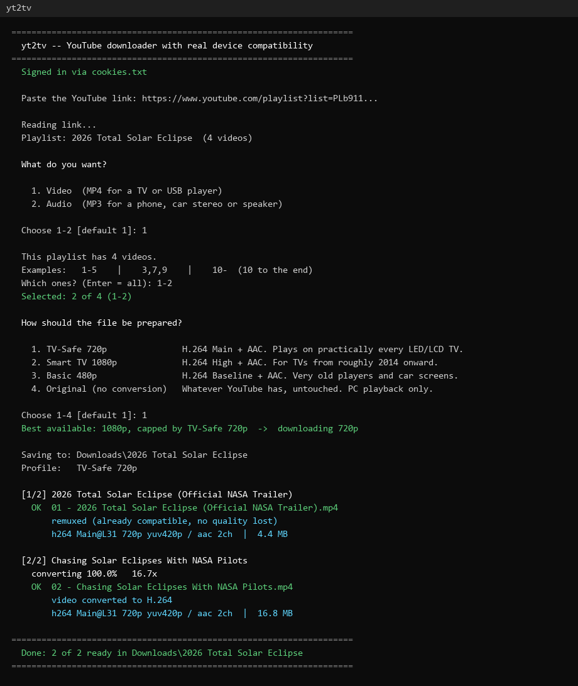

# yt2tv

Download YouTube videos and playlists as files that **actually play on a TV**.

Point it at a link, pick a profile, and you get a file that works on cheap LED
and LCD sets, USB media players and car screens — not just on the PC that made
it.

- **Single videos or whole playlists** — paste either link, it detects which
- **Part of a playlist** — `1-5`, `3,7,9`, `10-`, or all of it
- **Video or audio** — MP4 for a TV, or MP3 for a phone, car stereo or speaker
- **Four device profiles** — from H.264 Baseline 480p up to High 1080p



Two questions, then it works. Notice the last line of each download — it reports
the codec, profile, level and pixel format of the file it just produced, so you
can see it is actually TV-safe rather than hope so.

## Quick start

Download **`yt2tv.exe`** from the
[latest release](../../releases/latest), put it in an **empty folder**, and run
it. No Python, no install, nothing to configure — it fetches ffmpeg and Deno
itself on first launch.

> Windows SmartScreen warns about unrecognised apps because the exe isn't
> code-signed. Choose **More info → Run anyway**.

Keep it in its own folder: it creates `Downloads\` and `bin\` beside itself and
looks for `cookies.txt` there.

## Why this exists

If you download a YouTube video with yt-dlp and copy it to a USB stick, a cheap
TV will often refuse it. Two separate reasons, both non-obvious.

### 1. The codecs are wrong, and `--merge-output-format mp4` does not fix it

yt-dlp's default "best" gives **VP9 or AV1 video with Opus audio**. That flag
only changes the *container* — ffmpeg puts VP9/Opus inside an MP4 box. The
filename ends in `.mp4` but the codecs inside don't, and a TV reads codecs, not
extensions. Your PC plays it because VLC decodes VP9 in software.

yt2tv asks YouTube for **H.264 + AAC first**, checks the result with `ffprobe`,
and re-encodes only the stream that actually needs it. Most downloads are a
lossless remux finished in seconds.

### 2. Files over ~12.7 minutes get 64-bit headers that basic players can't read

This one is subtle. Left alone, ffmpeg derives the MP4 movie timescale from the
audio sample rate — typically **5,644,800**. The duration expressed in those
units crosses 2³² after **760 seconds**, so ffmpeg promotes `mvhd` and `elst` to
**version 1 (64-bit)**.

Basic USB players parse version 0 only. Past 12.7 minutes they sit on
*"loading"* forever, or report *"unsupported file"*, while short clips from the
same source play perfectly.

yt2tv pins the timescale to 1000, which keeps a 24-hour file inside 32 bits.
Diagnosed by comparing against a file that did work: byte-identical video
bitstream, different container headers.

| | Broken | Fixed |
|---|---|---|
| `mvhd` | version 1, timescale 5,644,800 | version 0, timescale 1,000 |
| `elst` | version 1 | none |

## What it does

- **Audio mode** gives 192 kbps MP3 with ID3v2.3 tags, so a car stereo shows
  the track name (2.3 deliberately — many head units show nothing for 2.4).
- **Each playlist gets its own folder**, numbered so a TV sorts the episodes in
  order — `001 -` and up once a playlist passes 100 videos.
- **Smart conversion.** Probes codec, profile, level, pixel format, frame rate
  and channels; remuxes losslessly when it can, converts only the stream that
  needs it.
- **Filenames that survive FAT32.** Non-Latin titles are transliterated
  (`हिंदी गाने` → `hiNdii gaane`), since cheap TV firmware chokes on them. The
  original title is kept in the file's metadata.
- **Macroblock-aligned 480p** (848 wide, not 854), because unaligned widths
  make some cheap decoders show green edges.
- **Warns past 4 GB**, which FAT32 cannot store.

## Troubleshooting

### "Sign in to confirm you're not a bot"

YouTube asks this of anyone downloading in volume. yt2tv automatically tries
cookies from your installed browsers; if none work, export a `cookies.txt`:

1. Install the **"Get cookies.txt LOCALLY"** extension in Chrome.
2. Open `youtube.com` and confirm you're logged in.
3. Export it as **`cookies.txt`** next to `yt2tv.exe`.

Chrome and Edge 127+ encrypt their cookie store, so *closing the browser does
not help* — the export is the way round it. Export from a **private window** and
close it without logging out, and the session won't be rotated by normal
browsing.

Use a throwaway account, not your main one.

### "The page needs to be reloaded."

Misleading message: YouTube guards stream URLs with a JavaScript challenge, and
yt-dlp needs a JS runtime to solve it. Setup installs Deno automatically; if it
didn't, run `winget install DenoLand.Deno` and `pip install -U yt-dlp-ejs`.

### USB sticks

Format **FAT32** for the widest compatibility — many old TVs won't mount exFAT
and fewer still read NTFS. Keep files in the root or one folder deep; some sets
won't recurse. Sticks of 32 GB or less mount more reliably on old hardware.

## Running from source

```
git clone <this repo>
cd yt2tv
Download.bat
```

Needs Python 3.8+ with **"Add python.exe to PATH"** ticked. `Download.bat` runs
`setup.py`, which installs `yt-dlp`, `Unidecode`, `yt-dlp-ejs`, ffmpeg and Deno.
It's safe to run every time — on a ready machine it finishes in about a quarter
of a second.

```
python yt2tv.py
python yt2tv.py "https://www.youtube.com/watch?v=..."
python yt2tv.py "https://www.youtube.com/playlist?list=..."
```

Run `pip install -U yt-dlp yt-dlp-ejs` every few weeks. An out-of-date yt-dlp is
the most common cause of downloads suddenly failing.

## Builds

GitHub Actions builds `yt2tv.exe` on every push and again weekly, so the
published binary never carries a yt-dlp more than a week old.

## A note on what you download

This tool doesn't care what you point it at, but YouTube's Terms of Service
prohibit downloading without permission, and redistributing commercial music or
films is copyright infringement in most countries whether or not money changes
hands. Content you own, Creative Commons material, public-domain works and
anything the uploader has permitted are all fine. What you do with it is your
responsibility.

## License

MIT — see [LICENSE](LICENSE).
